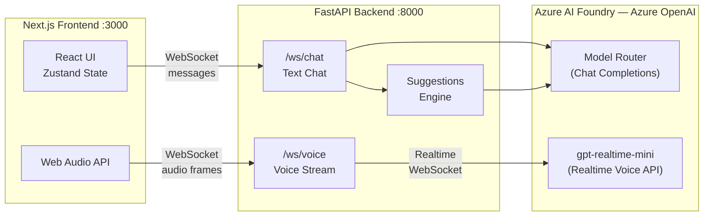

# DigiKey Web Voice Agent

An AI-powered voice and text assistant for DigiKey Electronics that provides personalized product recommendations and customer support through natural conversations. Built with a Next.js frontend, a Python FastAPI backend, and Azure OpenAI for both text chat (Model Router) and real-time voice (gpt-realtime-mini).

## Architecture



**Frontend** -- Next.js 14 (App Router), TypeScript, Zustand for state management, Web Audio API for microphone capture and playback, WebSocket client for real-time chat and voice streaming.

**Backend** -- Python FastAPI with WebSocket endpoints for text chat and voice. Integrates with Azure OpenAI Model Router for chat completions and gpt-realtime-mini via the Realtime API for voice conversations. Uses the Prompty framework for structured prompt management.

**Data** -- Product catalog, purchase history, and manufacturer data stored as JSON files. AI-powered product suggestion engine generates recommendations based on conversation context.

## Prerequisites

- **Node.js** 18+ and npm
- **Python** 3.10+
- **Azure OpenAI** resource (via Azure AI Foundry) with the following deployments:
  - `model-router` -- Azure Model Router for text chat and suggestions
  - `gpt-realtime-mini` -- for real-time voice conversations
- A browser that supports the Web Audio API and `getUserMedia` (Chrome, Edge, etc.)

## Setup

### 1. Clone the repository

```bash
git clone <repo-url>
cd web-voice-agent
```

### 2. Configure environment variables

**API backend** (required):

```bash
cp api/.env.example api/.env
```

Edit `api/.env` and fill in your Azure OpenAI credentials:

| Variable | Description |
|---|---|
| `AZURE_VOICE_ENDPOINT` | Azure AI Services endpoint for Realtime API |
| `AZURE_VOICE_KEY` | Azure AI Services API key |
| `AZURE_OPENAI_ENDPOINT` | Azure OpenAI endpoint for chat completions |
| `AZURE_OPENAI_API_KEY` | Azure OpenAI API key |
| `AZURE_VOICE_DEPLOYMENT` | Realtime API deployment name (default: `gpt-realtime-mini`) |
| `AZURE_OPENAI_DEPLOYMENT` | Chat deployment name (default: `model-router`) |
| `AZURE_VOICE_API_MODE` | `ga` or `preview` (see `api/.env.example` for details) |
| `LOCAL_TRACING_ENABLED` | Enable local tracing (default: `true`) |

### 3. Start the backend

```bash
cd api
pip install -r requirements.txt
uvicorn main:app --host 0.0.0.0 --port 8000 --reload
```

### 4. Start the frontend

```bash
cd web
npm install
npm run dev
```

The frontend will be available at `http://localhost:3000` and will connect to the backend at `ws://localhost:8000`.

### 5. VS Code (optional)

The project includes VS Code launch configurations. Press F5 to start debugging both frontend and backend simultaneously.

## Project Structure

```
web-voice-agent/
|-- api/                        # Python FastAPI backend
|   |-- main.py                 # Application entry point, WebSocket endpoints
|   |-- session.py              # Session and conversation management
|   |-- chat/                   # Chat prompty templates and data
|   |-- suggestions/            # Product suggestion engine
|   |-- voice/                  # Voice script templates
|   |-- tests/                  # Pytest test suite
|   |-- Dockerfile
|   +-- requirements.txt
|
|-- web/                        # Next.js frontend
|   |-- src/
|   |   |-- app/                # Next.js App Router pages
|   |   |-- components/         # React UI components (chat, voice, product catalog)
|   |   |-- store/              # Zustand state management (chat, voice, products)
|   |   +-- socket/             # WebSocket client and types
|   |-- e2e/                    # Playwright end-to-end tests
|   |-- public/                 # Static assets (product data, images, categories)
|   |-- Dockerfile
|   +-- package.json
|
|-- scripts/                    # Utility scripts for product data curation
|-- .github/workflows/          # CI/CD pipelines for Azure Container Apps
+-- .env.example                # Root env template (development tooling only)
```

## CI/CD

GitHub Actions workflows automatically build and deploy to Azure Container Apps on push to `main`:

- **`.github/workflows/azure-container-api.yml`** -- Builds and deploys the API container (triggers on changes to `api/`)
- **`.github/workflows/azure-container-web.yml`** -- Builds and deploys the web container (triggers on changes to `web/`)

### Required GitHub configuration

**Repository variables:**

| Variable | Default | Description |
|---|---|---|
| `ROOT_NAME` | `digikey-voice` | Base name for container apps |
| `AZURE_RESOURCE_GROUP` | `digikey-voice-agent` | Azure resource group |
| `AZURE_CONTAINER_ENV` | `digikey-voice-agent-env` | Azure Container Apps environment |

**Repository secrets:**

- `AZURE_CLIENT_ID`, `AZURE_TENANT_ID`, `AZURE_SUBSCRIPTION_ID` -- Azure OIDC authentication
- `REGISTRY_ENDPOINT`, `REGISTRY_USERNAME`, `REGISTRY_PASSWORD` -- Container registry credentials

## Testing

**End-to-end tests** (Playwright):

```bash
cd web
npx playwright test
```

Test specs are in `web/e2e/` and cover homepage rendering, navigation, chat replies, product browsing, and voice interactions.

**API tests** (pytest):

```bash
cd api
pytest tests/
```

**Frontend unit tests** (Vitest):

```bash
cd web
npm test
```

## Attribution

Originally based on [contoso-voice-agent](https://github.com/sethjuarez/contoso-voice-agent) by Seth Juarez, re-built and branded for DigiKey Electronics.
